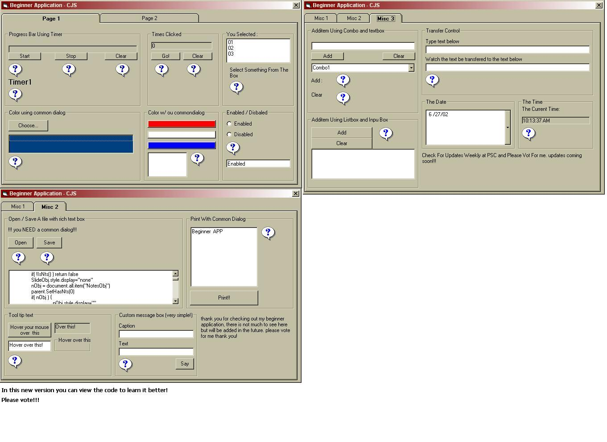



## Beginner App 2\.0 \*Updated\*

### Description

Beginner application version 2.0. helps all beginners lean some basics. Please vote what you think is fair ( at least a 5!) :D
 
### More Info
 

             |
---                |---
**Submitted On**   |2002-06-27 10:14:26
**By**             |[CJS](https://github.com/Planet-Source-Code/PSCIndex/blob/master/ByAuthor/cjs.md)
**Level**          |Beginner
**User Rating**    |5.0 (20 globes from 4 users)
**Compatibility**  |VB 6\.0
**Category**       |[Coding Standards](https://github.com/Planet-Source-Code/PSCIndex/blob/master/ByCategory/coding-standards__1-43.md)
**World**          |[Visual Basic](https://github.com/Planet-Source-Code/PSCIndex/blob/master/ByWorld/visual-basic.md)
**Archive File**   |[Beginner\_A994146272002\.zip](https://github.com/Planet-Source-Code/cjs-beginner-app-2-0-updated__1-36310/archive/master.zip)

